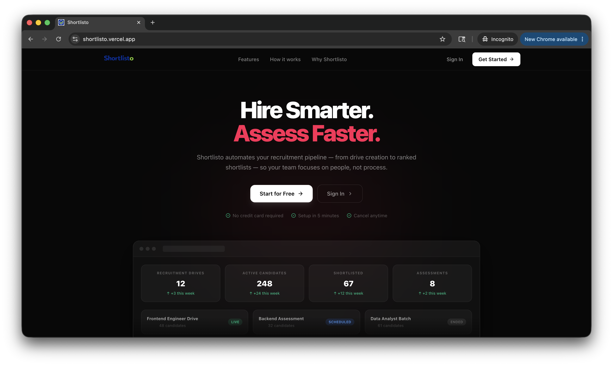
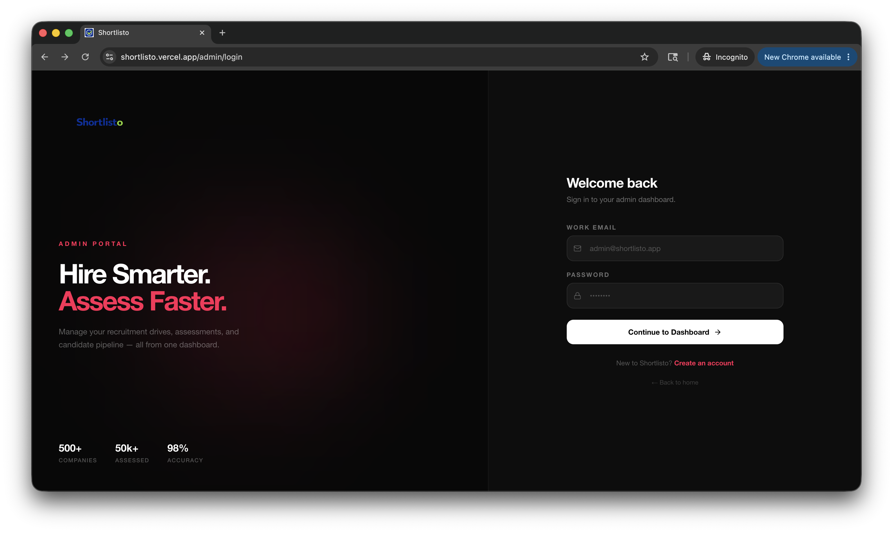
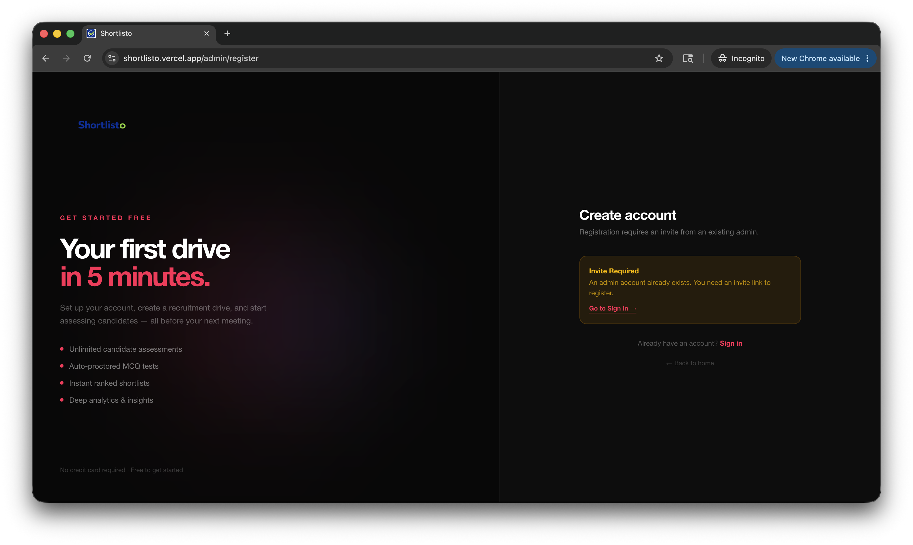

<div align="center">

# Shortlisto 🚀

### Full Stack Recruitment Management & Online Assessment Platform

A modern full-stack recruitment platform built to streamline hiring workflows, candidate evaluation, technical assessments, and analytics.

[](https://shortlisto.vercel.app/)
[](https://shortlisto-production.up.railway.app/health)
[]
[]
[]
[]
[]
[]
[]

</div>

---

## 📌 Overview

Shortlisto is a **full-stack recruitment management platform** designed to simplify and modernize hiring workflows.

It enables recruiters and organizations to:

- manage recruitment drives
- shortlist candidates efficiently
- conduct technical assessments
- evaluate applicant performance
- track analytics and hiring progress
- manage recruitment settings and workflows

The platform is built with a scalable production-style architecture using modern web technologies.

---

## 🌐 Live Deployment

### Frontend
🔗 https://shortlisto.vercel.app/

### Backend API
🔗 https://shortlisto-production.up.railway.app/

### Health Check
🔗 https://shortlisto-production.up.railway.app/health

---

## ✨ Core Features

### 🔐 Authentication & Authorization
- Secure JWT-based authentication
- Role-based access control
- Protected routes
- Session validation
- Secure password hashing using bcrypt

---

### 👥 Candidate Management
- Add and manage candidates
- Candidate profile tracking
- Application management
- Candidate evaluation workflow
- Recruitment pipeline management

---

### 📋 Recruitment Drive Management
- Create recruitment drives
- Manage active hiring campaigns
- Drive-specific candidate handling
- Recruitment workflow tracking

---

### 📝 Online Assessment System
- Technical assessment creation
- Question management
- Assessment scheduling
- Candidate test participation
- Automated result storage

---

### 📊 Analytics Dashboard
- Hiring analytics
- Candidate statistics
- Assessment performance insights
- Recruitment metrics
- Dashboard reporting

---

### ⚡ Realtime Communication
- Socket.IO powered realtime infrastructure
- JWT-authenticated websocket communication
- Live event handling

---

### ⚙️ System Configuration
- Platform settings management
- Configurable recruitment workflows
- Admin-level control panel

---

### 🛡 Security Features
- Helmet security middleware
- MongoDB injection protection
- CORS protection
- Input validation
- JWT authentication
- Secure API middleware

---

### 🚀 Performance Optimizations
- Response compression
- API caching
- Optimized Vite production build
- Code splitting / chunk optimization
- Static asset optimization

---

## 🏗 System Architecture

```text
┌───────────────────────┐
│   React Frontend      │
│   (Vercel Hosting)    │
└──────────┬────────────┘
           │
           │ REST API / Socket.IO
           ▼
┌───────────────────────┐
│   Node.js + Express   │
│   (Railway Hosting)   │
└──────────┬────────────┘
           │
           ▼
┌───────────────────────┐
│    MongoDB Atlas      │
│     Cloud Database    │
└───────────────────────┘
```

---

## 🛠 Tech Stack

### Frontend
- React.js
- Vite
- React Router DOM
- Axios
- TanStack React Query
- React Hot Toast
- Lucide React

### Backend
- Node.js
- Express.js
- Socket.IO
- JWT Authentication
- BcryptJS
- Winston Logging
- Node Cache
- Resend (Email API)

### Database
- MongoDB Atlas
- Mongoose ODM

### Security
- Helmet
- CORS
- Express Validator
- Express Mongo Sanitize

### Deployment
- Vercel (Frontend)
- Railway (Backend)
- MongoDB Atlas (Database)

---

## 📁 Project Structure

```bash
Shortlisto/
│
├── client/                 # Frontend (React + Vite)
│   ├── src/
│   ├── public/
│   └── package.json
│
├── server/                 # Backend (Node + Express)
│   ├── routes/
│   ├── controllers/
│   ├── middleware/
│   ├── models/
│   ├── workers/
│   ├── services/
│   └── package.json
│
└── README.md
```

---

## ⚙️ Local Setup

### Clone Repository

```bash
git clone https://github.com/Mangalam-17/Shortlisto.git
cd Shortlisto
```

---

### Install Frontend Dependencies

```bash
cd client
npm install
```

---

### Install Backend Dependencies

```bash
cd ../server
npm install
```

---

## 🔐 Environment Variables

### Backend (`server/.env`)

```env
PORT=8000
NODE_ENV=development
MONGO_URI=your_mongodb_connection_string
JWT_SECRET=your_super_secure_secret
JWT_EXPIRE=1d
CLIENT_URL=https://your-frontend-url.vercel.app
ALLOWED_ORIGINS=https://your-frontend-url.vercel.app,http://localhost:5173
BCRYPT_ROUNDS=12
RESEND_API_KEY=your_resend_api_key
```

---

### Frontend (`client/.env`)

```env
VITE_API_BASE_URL=http://localhost:8000/api
```

---

## ▶ Run Locally

### Backend

```bash
cd server
npm run dev
```

---

### Frontend

```bash
cd client
npm run dev
```

---

## API Modules

Available backend modules:

- `/api/auth`
- `/api/drives`
- `/api/dashboard`
- `/api/candidates`
- `/api/assessments`
- `/api/questions`
- `/api/results`
- `/api/analytics`
- `/api/settings`

---

## 📸 Screenshots

### 🏠 Hero / Landing Page


### 🔐 Login Page


### 📝 Register Page


---

## Deployment Architecture

### Frontend Hosting
**Vercel**

### Backend Hosting
**Railway**

### Database
**MongoDB Atlas**

---

## Future Enhancements

- Email notification workflows
- Advanced analytics dashboards
- Interview scheduling module
- Resume parsing integration
- AI-based candidate scoring
- Exportable recruitment reports

---

## 👨‍💻 Author

**Mangalam Vaishre**

- GitHub: https://github.com/Mangalam-17
- LinkedIn: Add your LinkedIn profile here

---

<div align="center">

### ⭐ If you like this project, consider starring the repository!

Built with ❤️ using MERN Stack

</div>